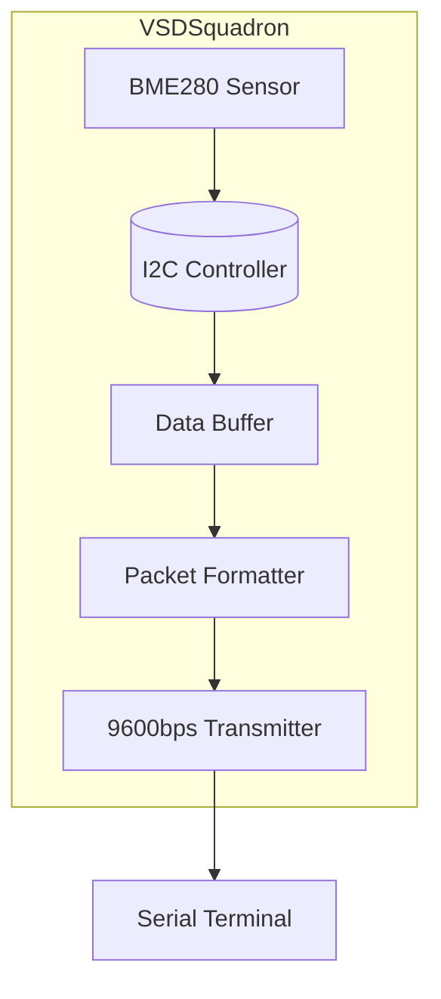
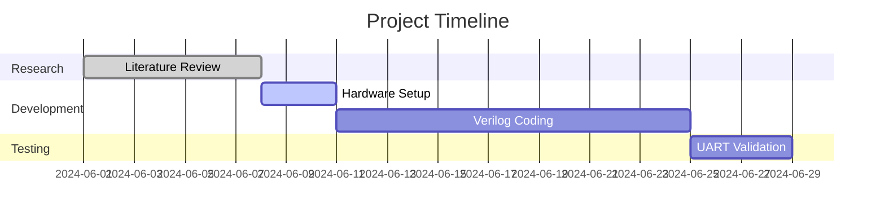

# FPGA-Based UART Sensor Data Acquisition System  
**Final Project Report**  
*Implemented on VSDSquadron FPGA Mini Board*

---

## 📌 Objectives  
1. **Conduct comprehensive research** on FPGA-based sensor data acquisition systems.  
2. **Formulate a detailed project proposal** outlining:  
   - System functionality  
   - Hardware/software requirements  
   - Implementation strategy  

---

## 🧪 Literature Review  

### 🔍 Key Findings from Existing Projects  

| Project                | Relevance to This Work                                |  
|------------------------|--------------------------------------------------------|  
| FPGA UART Transmitter  | Verified baud rate synchronization methods             |  
| I2C Sensor Integration | Validated BME280 communication protocol                |  
| Resource Optimization  | Spartan-7 utilization strategies for minimal LUT usage |  

**Research Tools Used**:  
- IEEE Xplore  
- Hackaday  
- GitHub FPGA Repositories  

---

## 🛠️ System Requirements  

### 🔩 Hardware Components  

| Component              | Specification                          |  
|------------------------|------------------------------------------|  
| FPGA Board             | VSDSquadron (Spartan-7 XC7S25)          |  
| Sensor                 | BME280 (Temperature/Humidity/Pressure)  |  
| USB-UART Converter     | CP2102 (3.3V compatible)                |  
| Connectivity           | 4.7kΩ pull-up resistors for I2C bus     |  

### 💻 Software Tools  

| Tool                   | Purpose                                  |  
|------------------------|-------------------------------------------|  
| Xilinx Vivado          | FPGA synthesis & bitstream generation     |  
| Python 3.10+           | Serial data visualization & validation    |  
| OpenFPGALoader         | FPGA programming on Linux systems         |  

---

## 🏗️ System Architecture  

### 🔄 Data Flow  

**Sensor Interface:**  
BME280 → I2C Controller (FPGA)

**Processing:**  
Raw data → Packetization (Header + CRC checksum)

**Transmission:**  
Packet → UART (9600 bps) → USB → PC Terminal

---

### 📊 Block Diagram  



---

## 📅 Project Plan  

### 🧱 Implementation Timeline  

| Phase             | Tasks                              | Duration  | Status     |
|------------------|-------------------------------------|-----------|------------|
| Research          | Literature survey, component selection | 1 Week    | ✅ Completed |
| Hardware Setup    | Sensor-FPGA integration            | 3 Days    | 🟡 Ongoing  |
| FPGA Development  | Verilog coding, synthesis          | 2 Weeks   | 🔲 Pending  |
| Validation        | UART data verification             | 4 Days    | 🔲 Pending  |

### 🗓️ Gantt Chart  



---

## 📑 Deliverables  

### 📁 Project Proposal Document  
**Contents:**  
- Objective analysis  
- Resource cost estimation  
- Risk mitigation strategies  
- System architecture diagrams  

### 📐 Diagrams  
- Block Diagram  
- Circuit Schematic (To be added using Vivado Schematic View)  

### 📋 Detailed Plan  
- Gantt Chart  
- Timeline Milestones  

**Milestones:**  
- ⏳ *June 15, 2024*: Complete Verilog state machine  
- ✅ *June 25, 2024*: First successful UART data transmission  

---

## 🔍 Testing Protocol  

### ✅ UART Validation Steps  

#### Loopback Test  
```python
# Python validation script  
import serial  
ser = serial.Serial('/dev/ttyUSB0', 9600)  
ser.write(b'TEST')  
assert ser.read(4) == b'TEST'  
```

#### Sensor Data Format (Expected Output)  
```bash
[AA][01][TEMPERATURE_MSB][TEMPERATURE_LSB][CRC]
```

---

## ⚠️ Troubleshooting Guide  

| Issue                     | Debugging Method                             |
|---------------------------|----------------------------------------------|
| I2C communication fail    | Verify 4.7kΩ pull-up resistors               |
| UART data corruption      | Check UART clock divisor (1250 @ 12MHz)     |
| FPGA programming error    | Confirm JTAG and USB connection stability   |

---

## 📚 References  

- [Xilinx Spartan-7 Datasheet (XC7S25)](https://www.xilinx.com/products/silicon-devices/fpga/spartan-7.html)  
- [Bosch BME280 Sensor Protocol Guide](https://www.bosch-sensortec.com/products/environmental-sensors/humidity-sensors-bme280/)  
- [UART Protocol Specification (RS-232)](https://en.wikipedia.org/wiki/RS-232)  

---

## ✅ Status Summary  

- [x] Literature Review Complete  
- [x] Hardware Identified  
- [ ] Verilog Design In Progress  
- [ ] UART Verified with Loopback  
- [ ] Sensor Data Integrated and Displayed

---

## 👨‍💻 Authors  
**Developed by:** *Your Name*  
*Under the guidance of:* *Prof. ABC XYZ*  
*Institution:* *XYZ University of Technology*
